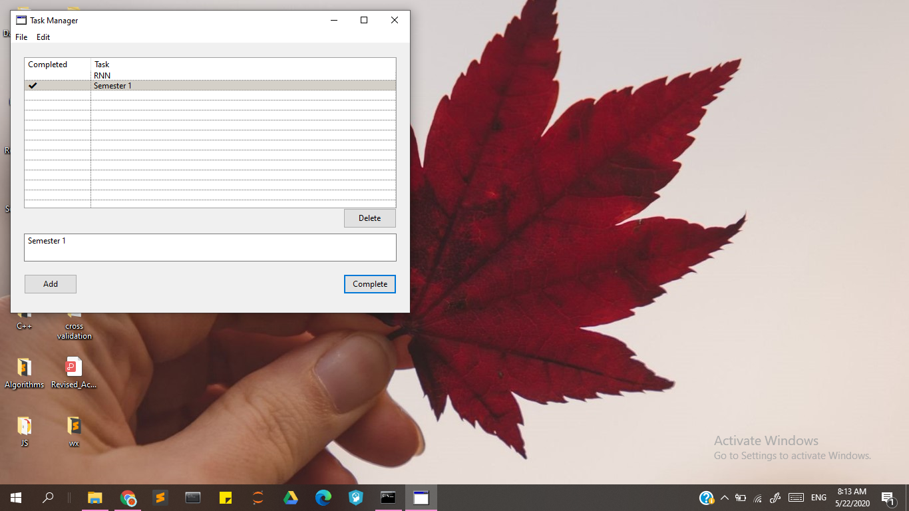

<h2> MultiPlatform To-do Desktop App</h2>

 Wanna manage your time in Lockdown ? 

<I>This app supports all three major operating systems so no dependency issue ! </I>

### Linux: 

### Windows:

<I>Download the [zip](https://github.com/shivanshuman021/TaskManager/archive/master.zip) now and make most out of your time durin COVID19 crisis </I>

<I><B>And don't forget to enjoy your life !! </B></I>

### User Guide
  1. Download the zip from [here](https://github.com/shivanshuman021/TaskManager/archive/master.zip) 
  2. Extract and navigate to the respective OS folder 
  3. Simply double click on the TaskManager.exe file to run the app.
  
  
 

<I>Developed and Maintained by: </I>
<B>Anshuman Mishra</B>

